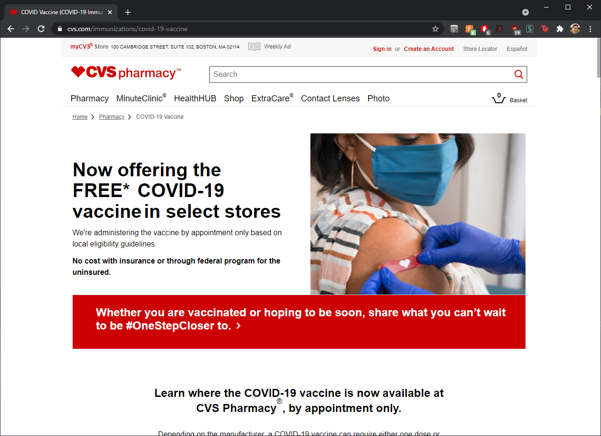
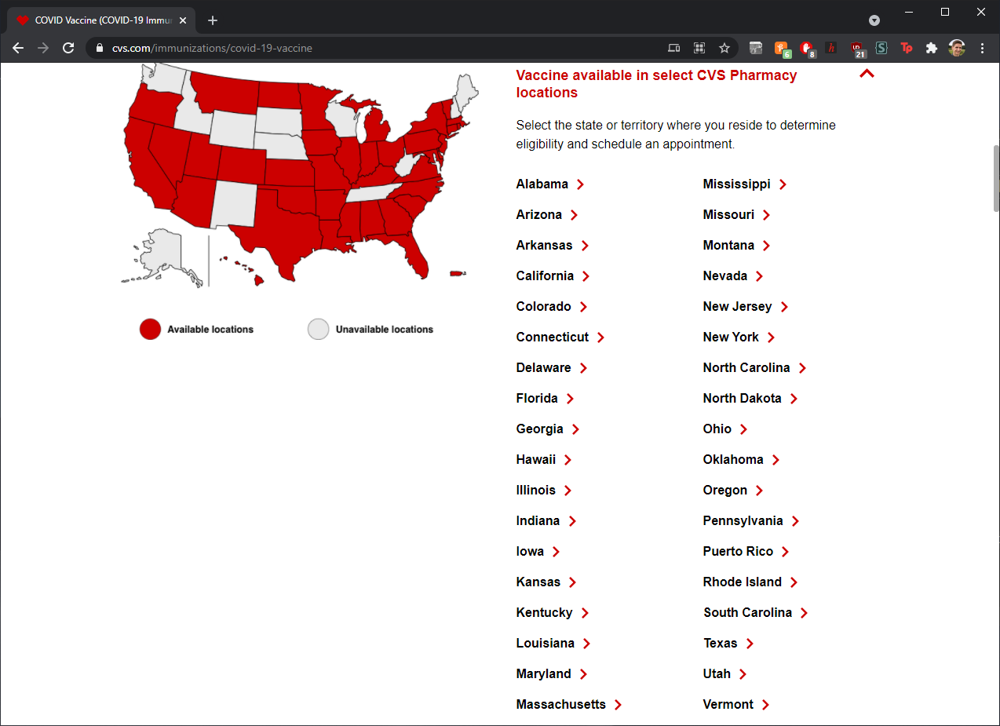

# COVID-19 Vaccine Appointments
_Sam Gaudet, March 2021_

Here is a brief summary of what I[**](#disclaimers) learned booking COVID-19 vaccine appointments over the weekend.

## TL;DR

Fill out the form on CVS in advance; re-load the page at low traffic times, such as midnight or 4AM.

## Scheduling

In Massachusetts (the focus of this document), scheduling can ~~easily~~ be done through CVS. To begin, check out the CVS COVID-19 vaccine homepage [here](https://www.cvs.com/immunizations/covid-19-vaccine).

Scrolling down, you can see if there are any open appointments by clicking the 'Massachusetts' link, which will open a window within the page (there probably will not be any open appointments).

When there are appointments available, you will see a hyperlink that will bring you to the scheduling form. This form requires you to answer these questions:

1. _placeholder_

## Tips

1. I have noticed that the appointments seem to refresh about every 15 minutes or so. That said, they are often a few minutes behind, so taking note of the timestamp in the available appointments window can give you an expectation of when they will be updated next.\
\
For instance, if you notice in the images above that the last update was at 2:22PM, it may be best to try and reload the page at exactly 2:37PM to see the next update. More importantly, this also means that reloading once every 15 minutes puts you in line with the apparent refresh rate of CVS's backend.

2. Keeping the zip-code search (that appears _after_ the initial form) open can allow you to refresh the scheduling data without needing to re-enter and re-submit the initial form data every time.\
\
Instead, simply enter a new zip-code or tap the search button again to refresh the results on this page.

3. Notice patterns about availability and note those zip-codes for use later. When I was scheduling appointments for my parents, I saw that Greenfield, MA was the closest destination with regularly added appointments. On the scheduling page I made note of the zip-codes to check for Greenfield: 01301 and 01302.

4. Have the information you will need to confirm the appointment ready to go when you are attempting to schedule. This information will include: full name, age, date of birth, health care provider (name), member ID, group ID, and a few specific questions pertaining to the vaccine (e.g. have you tested positive for COVID-19 within the last two weeks, do you have any blood disorders, etc.). If you are scheduling for a family / other person, you will want to make sure you have this information in advance of attempting to schedule.

4. Scheduling on a phone can be easier to refresh late at night, especially if you are setting an alarm for yourself to get up in the middle of the night.

---
## Disclaimers

**_I am not a medical professional and this advice is merely intended to help others find an easier time navigating the digital obstacles that stand between them and a vaccine._
