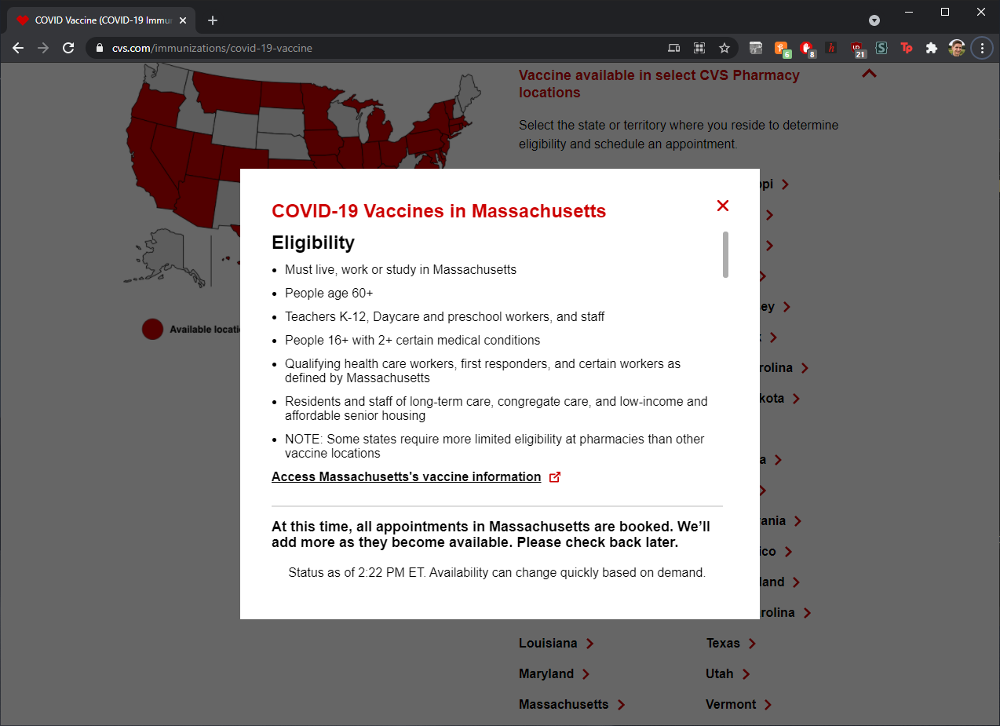
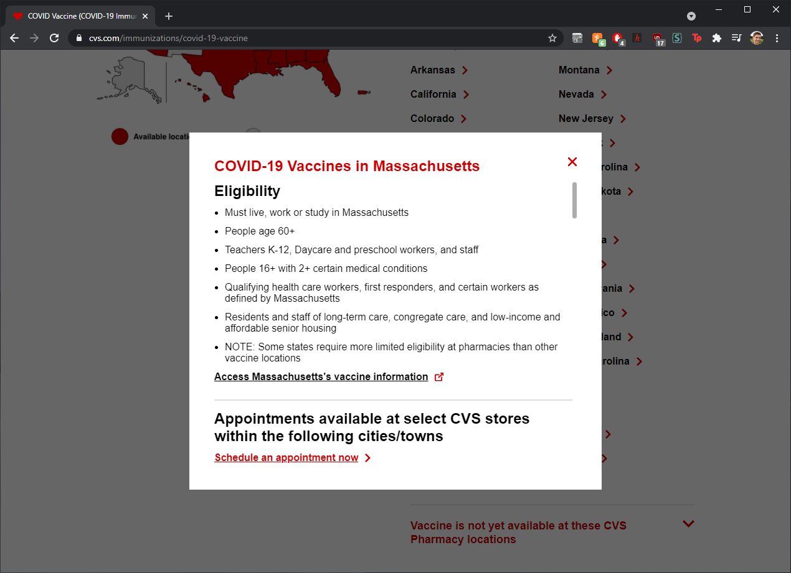
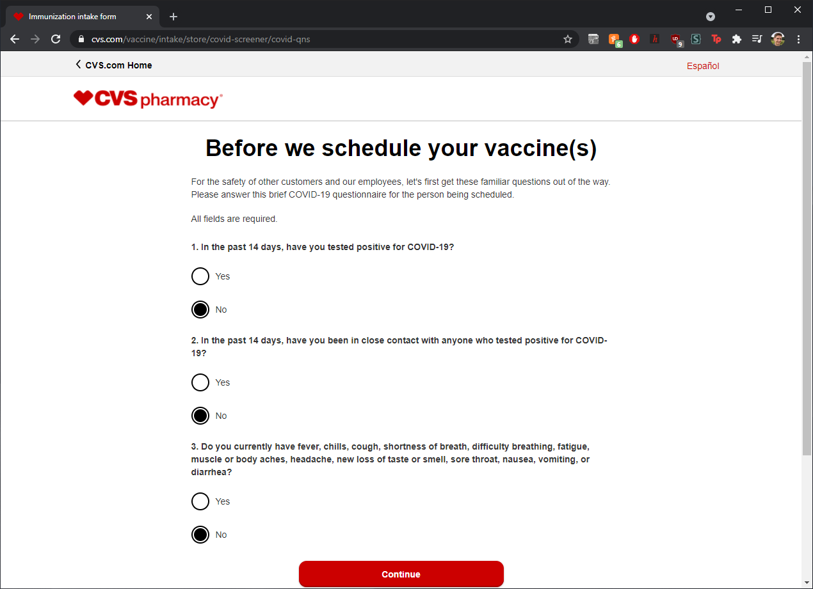
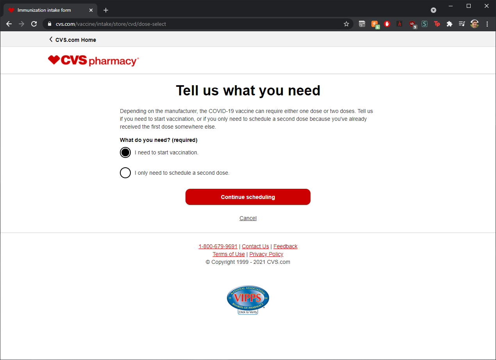
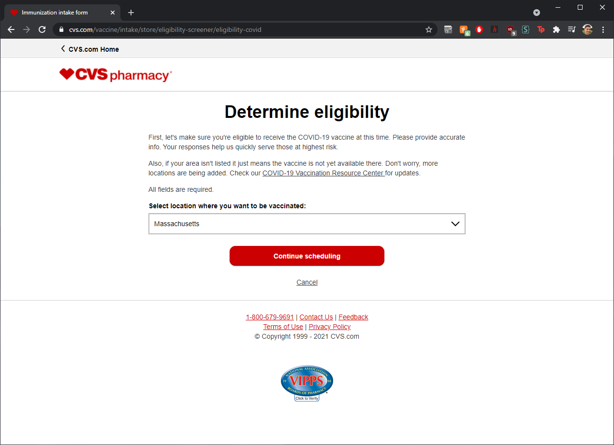
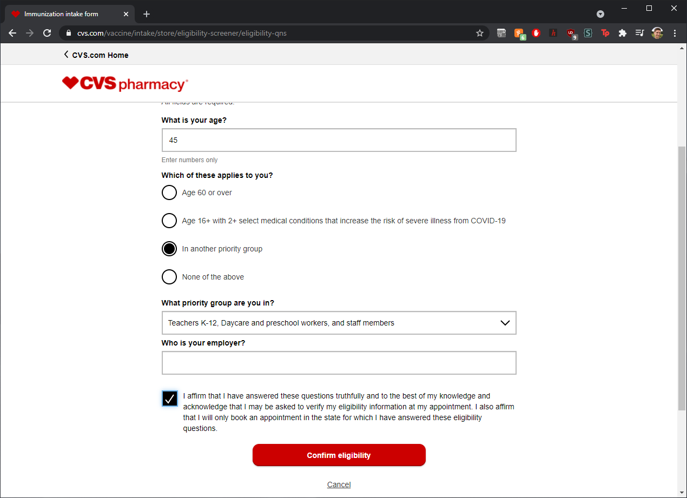
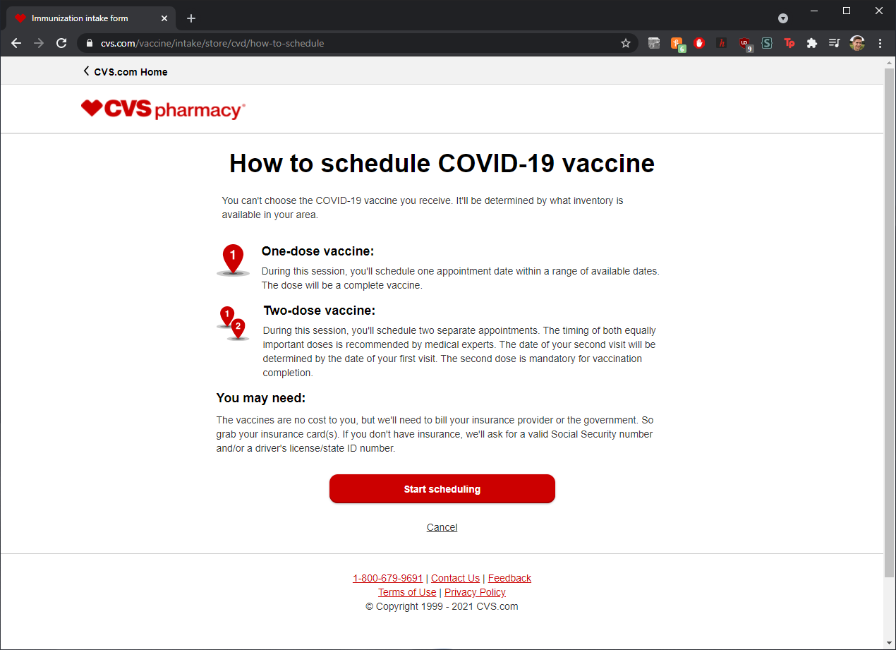
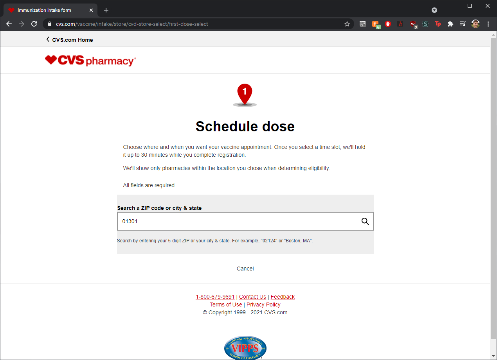
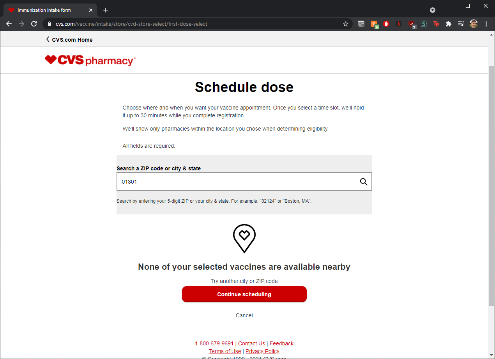
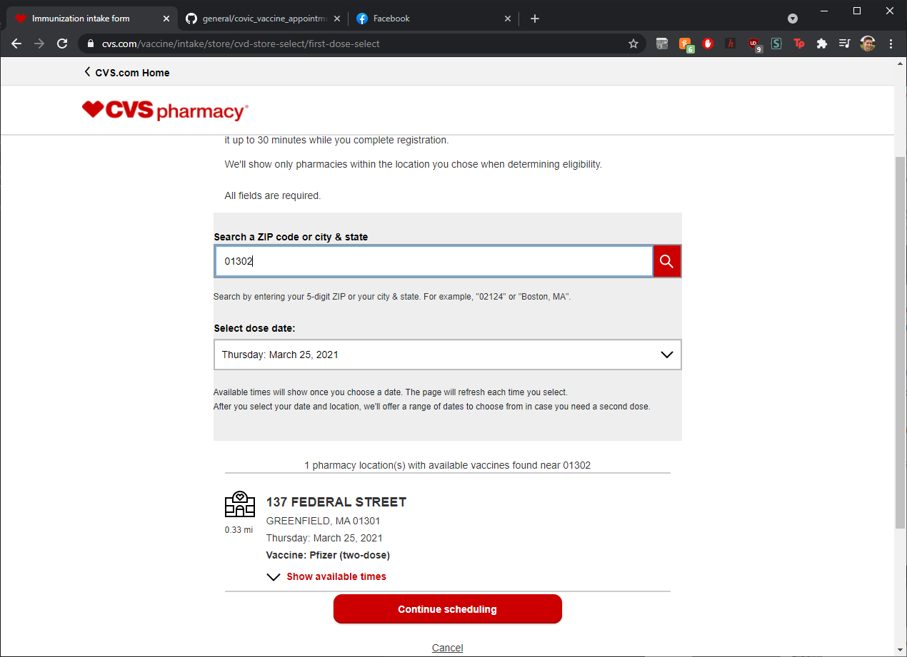

# COVID-19 Vaccine Appointments
_Sam Gaudet, March 2021_

Here is a brief summary of what I[**](#disclaimers) learned booking COVID-19 vaccine appointments over the weekend.

## TL;DR

Fill out the form on CVS in advance; re-load the page at low traffic times, such as midnight or 4AM.

## Links

[MA Government: How to prepare for your COVID-19 vaccine appointment](https://www.mass.gov/guides/how-to-prepare-for-your-covid-19-vaccine-appointment)  
[MA Government: Massachusetts' COVID-19 vaccination phases](https://www.mass.gov/info-details/massachusetts-covid-19-vaccination-phases) ("when am I eligible?")  
[CVS: COVID-19 Vaccine page](https://www.cvs.com/immunizations/covid-19-vaccine)

## Scheduling

In Massachusetts (the focus of this document), scheduling can ~~easily~~ be done through CVS. To begin, check out the CVS COVID-19 vaccine homepage [here](https://www.cvs.com/immunizations/covid-19-vaccine).

Scrolling down, you can see if there are any open appointments by clicking the 'Massachusetts' link, which will open a window within the page (there probably will not be any open appointments).

When there are appointments available, you will see a hyperlink that will bring you to the scheduling form. This form requires you to answer these questions:

1. In the past 14 days, have you tested positive for COVID-19?
2. In the past 14 days, have you been in close contact with anyone who tested positive for COVID-19?
3. Do you currently have fever, chills, cough, shortness of breath, difficulty breathing, fatigue, muscle or body aches, headache, new loss of taste or smell, sore throat, nausea, vomiting, or diarrhea?
4. What you need? ("I need to start vaccination" or "I only need to schedule a second dose")

Here is a step-by-step set of images of the process, when an appointment is available:

## Tips

1. The most successful time to look for an appointment is directly after a number of new appointments have been added. Typically this occurs between 12AM and 4AM, as well as between 6AM and 6:30AM on Friday mornings.

2. I have noticed that the appointments seem to refresh about every 15 minutes or so. That said, they are often a few minutes behind, so taking note of the timestamp in the available appointments window can give you an expectation of when they will be updated next.\
\
For instance, if you notice in the images above that the last update was at 2:22PM, it may be best to try and reload the page at exactly 2:37PM to see the next update. More importantly, this also means that reloading once every 15 minutes puts you in line with the apparent refresh rate of CVS's backend.

3. Keeping the zip-code search (that appears _after_ the initial form) open can allow you to refresh the scheduling data without needing to re-enter and re-submit the initial form data every time.\
\
Instead, simply enter a new zip-code or tap the search button again to refresh the results on this page (note that refreshing this page itself in the browser will kick you back to the initial form).\
\
Some people have had luck pre-loading this screen by using another state (not MA) to get past the first screen, before using MA zip-codes in the search bar.

4. Notice patterns about availability and note those zip-codes for use later. When I was scheduling appointments for my parents, I saw that Greenfield, MA was the closest destination with regularly added appointments. On the scheduling page I made note of the zip-codes to check for Greenfield: 01301 and 01302.\
\
In my experience, availability in a given city can appear under one zip-code and not another, so I would always recommend checking all zip-codes you are watching, as well as the city name itself.

5. Have the information you will need to confirm the appointment ready to go when you are attempting to schedule. This information will include: full name, age, date of birth, health insurance provider (name), member ID (or medicare ID if relevant), group ID, and a few specific questions pertaining to the vaccine (e.g. have you tested positive for COVID-19 within the last two weeks, do you have any blood disorders, etc.). If you are scheduling for a family / other person, you will want to make sure you have this information in advance of attempting to schedule.

6. Scheduling on a phone can be easier to refresh late at night, especially if you are setting an alarm for yourself to get up in the middle of the night.

7. If you live outside of MA, and particularly on the West coast, having a friend on the East coast book for you can be particularly helpful given the odd times when appointments are mainly refreshed.

## Visual examples

Here are two visual examples of key workarounds to use.

### Navigate past the first page using a different state

Note that using a state that has available appointments allows you to access the pre-screen form, which in turn allows you to follow tip number 3 above.

### Use the zip-code search to refresh appointment data

Note that using the search instead of refreshing the page avoids needing to re-enter the form data previously filled-out.

---
## Disclaimers

**_I am not a medical professional and this advice is merely intended to help others find an easier time navigating the digital obstacles that stand between them and a vaccine._
